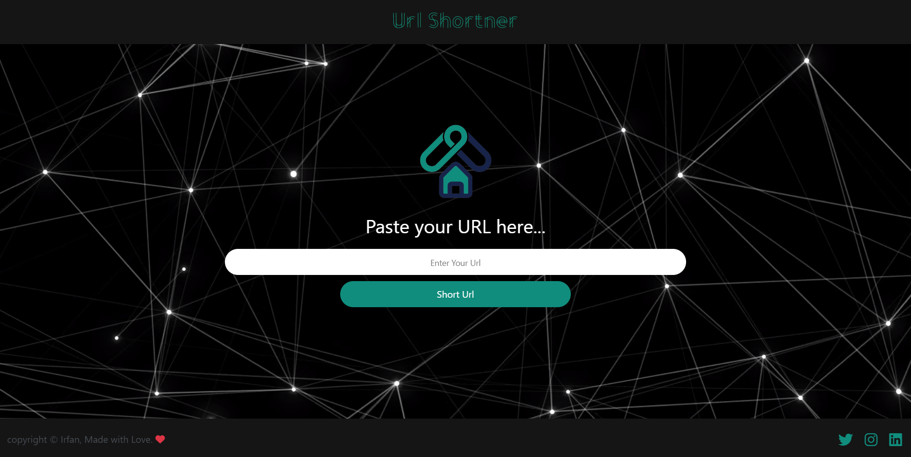

# URL-shortner

## Description
This is a simple URL shortener website created using JavaScript and Bootstrap. It utilizes the TinyURL API to shorten links and features a live background effect.

## Features
- Shorten long URLs into compact, shareable links using TinyURL API.
- Live background effect for an engaging user experience.

## Technologies Used
- Html
- css
- JavaScript
- Bootstrap
- TinyURL API

## How to Use
1. Clone the repository to your local machine.
2. Open `index.html` in your preferred web browser.
3. Enter a long URL into the input field.
4. Click the "Shorten" button to generate a shortened URL.
5. Copy the shortened URL and share it as needed.

## Screenshots
 

## Live Demo

https://github.com/irfan-H4/URL-shortner/assets/153440139/deadf953-d53e-4a8d-a53e-ff7b21401953

## Credits
- TinyURL API: [https://tinyurl.com/tools/api-docs](https://tinyurl.com/tools/api-docs)

